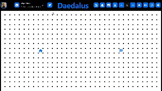

<h1 align="center">Daedalus 🧭</h1>

  
Daedalus brings mazes to life! ✨  
  Watch as intricate mazes are generated and solved step-by-step 👣. It's like magic, but it's algorithms! 🧠

## 📖 Introduction

I've always been fascinated by the elegance and beauty of algorithms, especially those used to create and solve mazes. Daedalus is my way of bringing those algorithms to life – a simple, yet visually captivating way to explore their beauty.

I hope you have as much fun playing with this project as I had creating it! 😊

  ☝️ **Click to see Daedalus in action!**

## 🚀 Technologies & Tools
- TypeScript.
- 2D canvas API.
- Nextjs and NextUI componments.

## ✨ Features
* **Watch mazes come to life:** Witness the step-by-step creation and navigation of intricate mazes, all in real-time 📽️.

* **Adapts on the fly:** Effortlessly adjust the grid or move the start/finish points, and watch the path recalculate instantly ⚡.

* **Depth filter:** Mazes are colored using filter, showing the distance from a starting point in vibrant hues 🎨.

* **Simple controles:** Seamlessly adjust animation speed, pause to analyze the process, or reset with ease – all without a single refresh 🕹️.

## 🤓 The Algorithms

Before we dive into the algorithms, let's understand a few key concepts:

### 1. Graphs & Mazes 🗺️
* **Graph:** Think of a graph like a connect-the-dots puzzle. Each dot is a "node," and the lines between them are "edges." Nodes can represent anything – cities, websites, or even locations in a maze. The edges show the possible paths between nodes.
* **Manhattan Grid:** Daedalus uses a special type of graph called a "Manhattan grid" to represent mazes. It's like a city block where you can only move horizontally or vertically along the streets (the edges).

### 2. Weight, Cost, & Distance ⚖️
Think of a maze as a simple graph:
* **Nodes:** These are the points or intersections in the maze.
* **Edges:** These are the paths (corridors) between the nodes.

* **Weight:** Each edge (path) can have a weight. Imagine it like a difficulty level for that path. 
    * For example:
        * A narrow, twisting path might have a weight of 5.
        * A wide, straight path might have a weight of 1.
* **Cost:** The total weight of all the paths you've taken so far to reach a certain point (node). Think of it like the total energy or effort you've spent.
* **Distance:** How far apart two nodes are, regardless of the path taken. It's the shortest possible straight line, even if you can't walk that way in the maze.

**Why it Matters:**

Different algorithms care about different things:

* **Some algorithms want the shortest distance:** They might ignore weights and just find the path with the fewest turns.
* **Some algorithms want the lowest cost:** They'll consider weights and try to find the easiest, most efficient route, even if it's a bit longer. 

**In Daedalus:** You can play around with weighted and unweighted paths to see how these ideas affect the way your maze is solved!

### 3. Heuristics in Algorithms 🧠

**Imagine you're trying to find the quickest route to a friend's house across town.** You could wander around randomly, but that would take forever. Instead, you use a heuristic – a rule of thumb – to guide you.

**Heuristic:** It's like a shortcut or a best guess to help you make decisions faster. It might not always be perfect, but it's usually helpful.

**In our example, your heuristic might be:** "Always move towards my friend's neighborhood."

This doesn't guarantee the fastest route, but it's a lot better than going in random directions. You might take a slightly longer route, but you'll get there much faster overall.

**In Pathfinding Algorithms:**

Heuristics work similarly, It's like the algorithm's "instinct" for finding its way through the maze. Imagine the algorithm is navigating a maze to find the exit. A common heuristic is the "Manhattan distance" – the straight-line distance to the goal.

**The algorithm thinks:** "I don't know the exact path yet, but I'll prioritize exploring paths that seem to be getting closer to the exit based on this straight-line distance."

**Why Heuristics Matter:**

* **They make algorithms faster:** By focusing on promising directions, algorithms avoid exploring useless paths.
* **They don't always guarantee the best solution:** Sometimes, the heuristic might lead the algorithm astray, but in most cases, it significantly speeds things up.

**now with that out of the way let's check the algorithms used in Daedalus.**

### 🤖 Maze Generation Algorithms
* **Simplified Prim:** This algorithm is a modified version of the original Prim graph MST (minimum spanning tree) algorithm.
    - It randomly selects a cell from a set of cells that are intended to be visited, adds a random unvisited neighbour of that cell to the set, and links it to the current cell. This process is repeated until all grid cells are visited.

* **Recursive Backtracker:** This algorithm is a tweaked implementation of the graphs algorithm DFS (depth-first search).
    - It explores the grid as deep as it can in random directions before backtracking to the last place where it can continue exploring until the grid is fully explored.

* **Recursive Divider:** This algorithm creates mazes by placing walls on an empty grid, 
    It differs from conventional methods of carving out the maze features.
    - It divides the available space into two at a random point and repeats this process recursively until further divisions are not possible.

* **Randomized Kruskal:** This algorithm is a modified version of the original Kruskal graph MST (minimum spanning tree) algorithm.
    - It utilizes sets to maintain the connected parts of the maze and deconstructs walls between every pair of unlinked sets until all sets are connected.

### 🕵️ Path-Finding Algorithms
* **Dijkstra:** This algorithm ensures the shortest path and supports weighted graphs.
    - It works by expanding outward from the starting node,
    visiting nodes closer to the start first while taking into account the additional cost imposed by the weighted cells.
    - It uses the Priority Queue Data Structure.
* **A\* (A-star):** This graph search algorithm ensures the shortest path and supports weighted graphs.
    - It combines aspects of Dijkstra's algorithm and heuristics to find the shortest path between two nodes in a graph.
    - It prioritizes the nodes that are estimated to be closer to the goal based on a heuristic  function (Manhattan distance). \
    By intelligently guiding the search towards the goal, It can often find the optimal path more quickly than Dijkstra's algorithm, especially in large graphs.
    - It uses the Priority Queue Data Structure.
* **Breadth first search (BFS):** This algorithm ensures the shortest path but does not support weighted graphs.
    - It searches by expanding outward from the starting node,
    visiting nodes closer to the start first.
    - It uses the Queue Data Structure (first in, first out).
